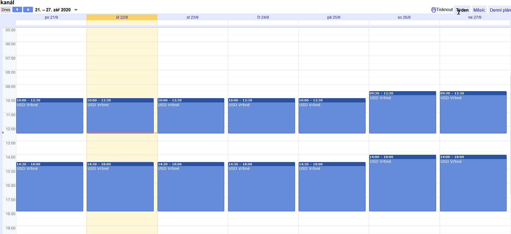
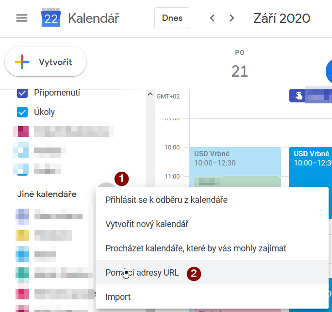
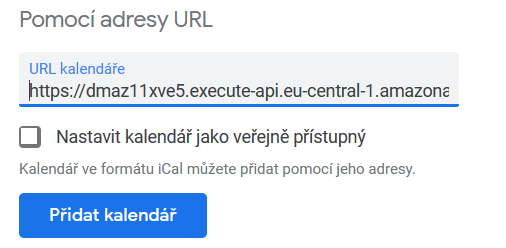
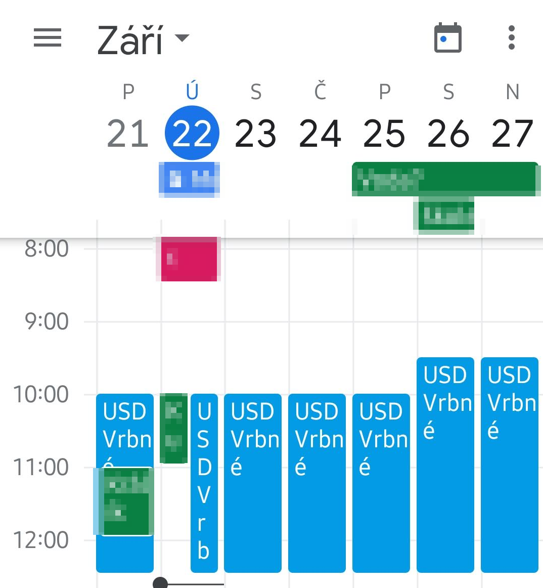
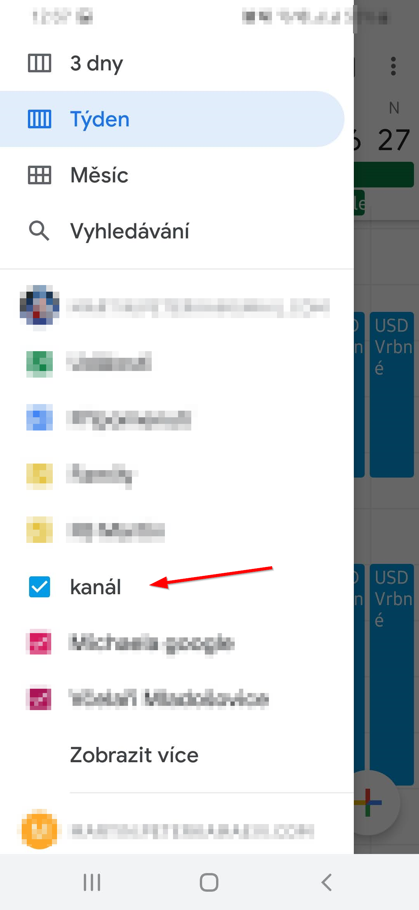

# Google Calendar

* [calendar.google.com](https://calendar.google.com)
* Jiné kalendáře, tlačítko `[+]`

* Pomocí adresy URL
* Vložit adresu `https://dmaz11xve5.execute-api.eu-central-1.amazonaws.com/dev/icalendar`

## Android
Zde to může být různé...
* Aplikace Kalendář

* Povolit zobrazení (a synchronizaci) kalendáře

