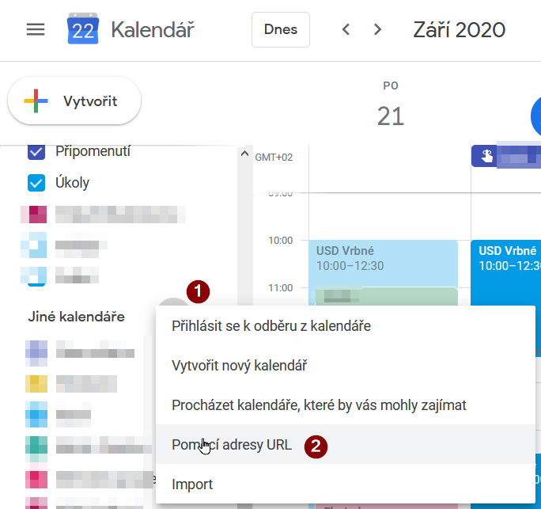
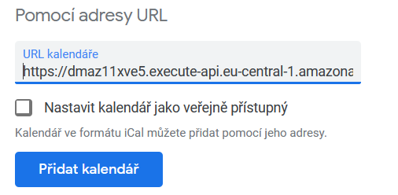
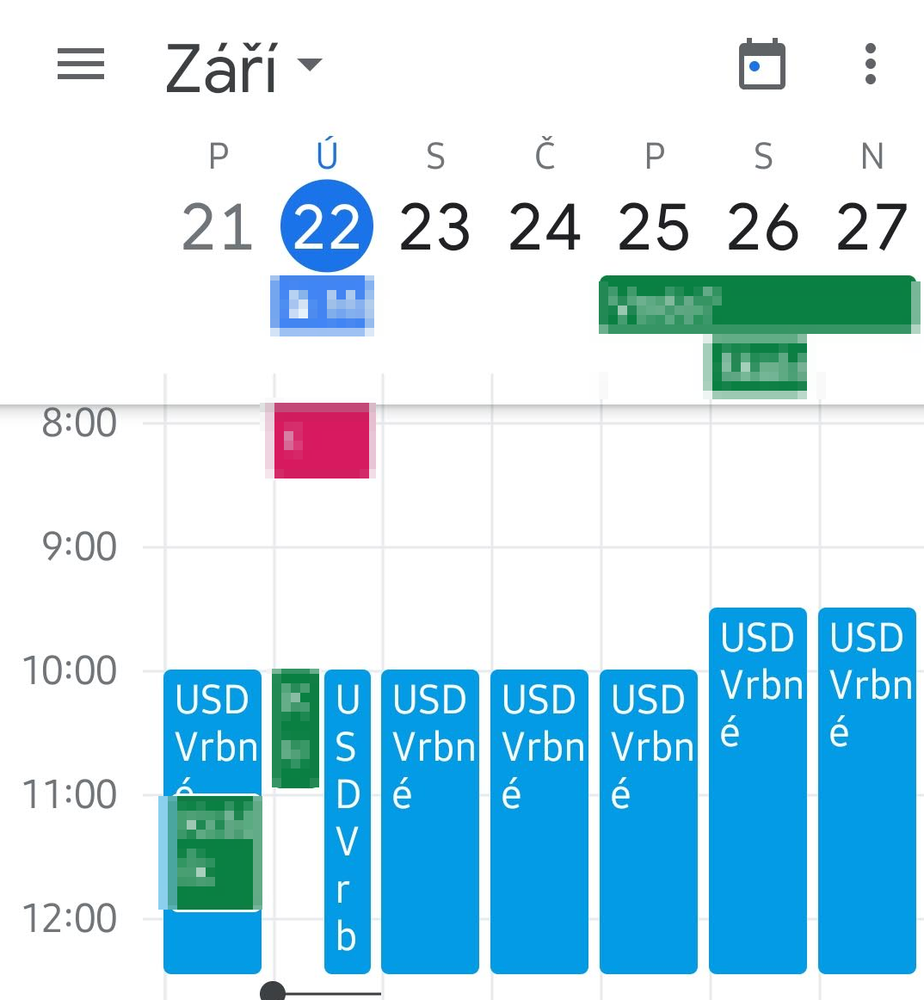
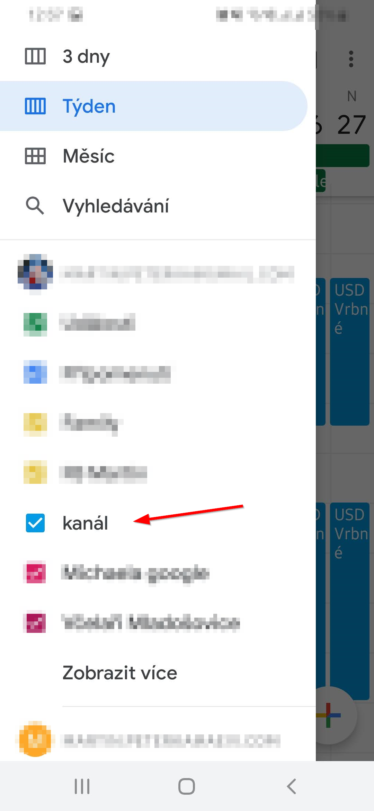

# Google Kalendář

Google Kalendář automaticky stahuje iCal data přibližně jednou denně (není možné vynutit okamžitou aktualizaci ze strany klienta).

## Postup přidání (Web)

1. Otevřete [calendar.google.com](https://calendar.google.com).
2. Vlevo u sekce **Jiné kalendáře** klikněte na tlačítko `[+]`.
3. Vyberte **Pomocí adresy URL**.
4. Vložte adresu vašeho iCal endpointu (např. `https://karotka.peterka.name/vrbne/ical`).
5. Potvrďte přidání.

## Android

V aplikaci Kalendář na Androidu se kalendář objeví automaticky po přidání do Google účtu na webu, ale může být potřeba jej povolit v nastavení:

1. Otevřete aplikaci Kalendář.
2. V menu vyberte **Nastavení**.
3. Najděte přidaný kalendář a ujistěte se, že je zapnutá **Synchronizace**.

