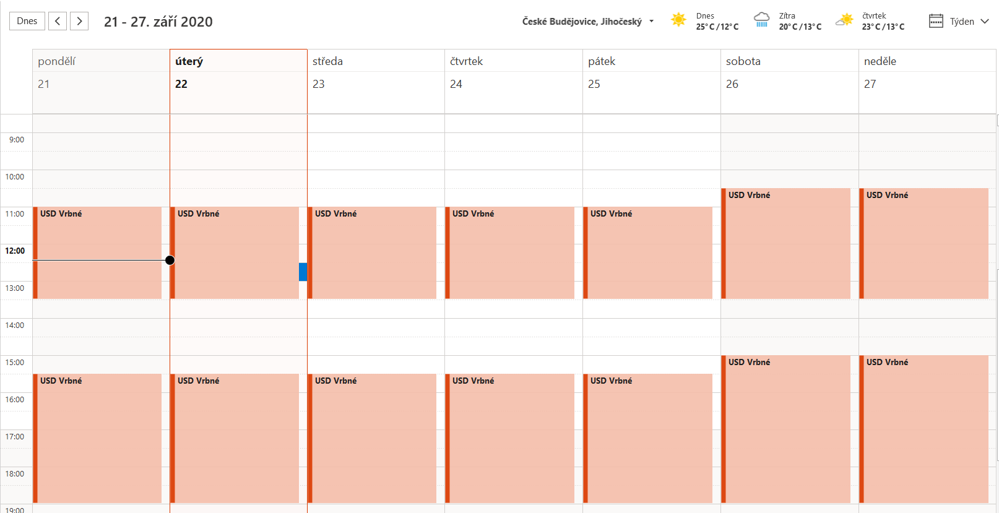
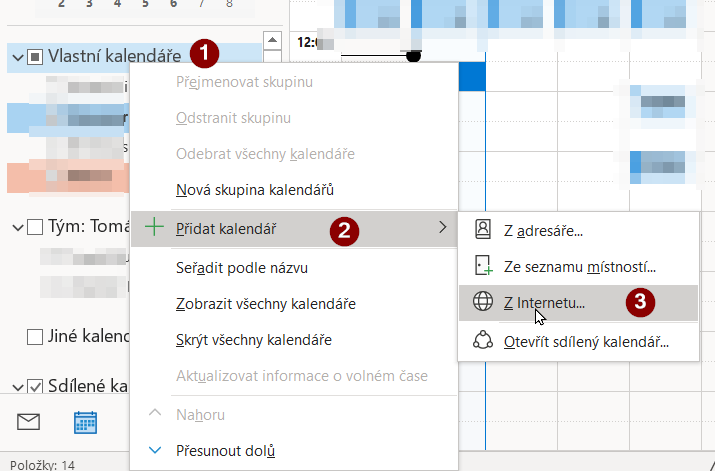
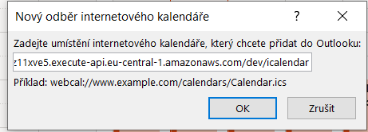

# Microsoft Outlook

Pozor, někde je chyba - MS Outlook nezobrazuje čas ve správné časové zóně!

* https://stackoverflow.com/questions/35645402/how-to-specify-timezone-in-ics-file-which-will-work-efficiently-with-google-outl
* https://answers.microsoft.com/en-us/msoffice/forum/all/outlook-cant-read-timezone-in-ics-file-a-slew-of/495cadf9-4630-48b5-99ce-88d94980f289
* https://techcommunity.microsoft.com/t5/office-365-calendar/calendar-incorrectly-reading-ics-file-time-and-timezone-are/m-p/254129

* Kalendář
* Vlastní kalendáře, pravé tlačítko
* Přidat kalendář

* Z Internetu
* Vložit adresu `https://dmaz11xve5.execute-api.eu-central-1.amazonaws.com/dev/icalendar`

