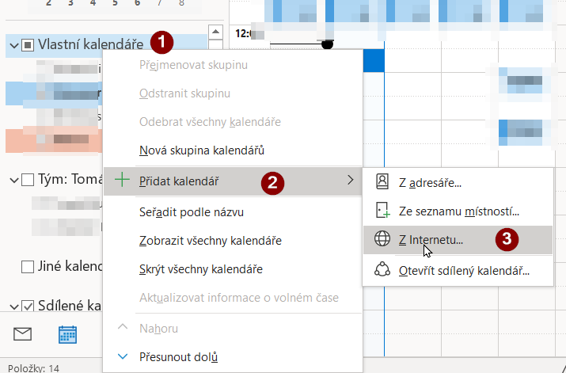
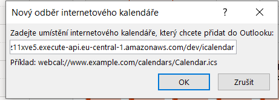
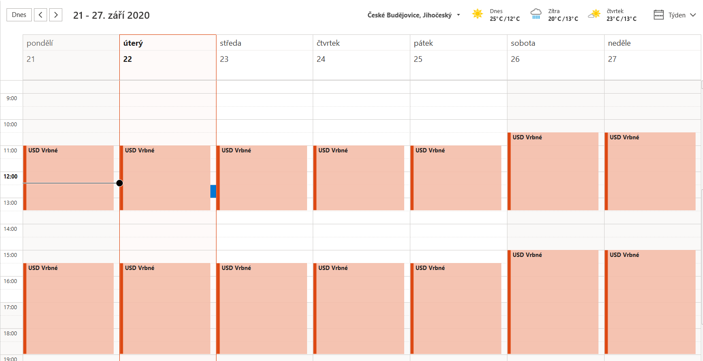

# Microsoft Outlook

Díky implementaci `VTIMEZONE` nyní Microsoft Outlook správně interpretuje časovou zónu (Evropa/Praha).

## Postup přidání

1. V Outlooku přejděte do sekce **Kalendář**.
2. Klikněte pravým tlačítkem na **Moje kalendáře** (nebo jiné uskupení).
3. Vyberte **Přidat kalendář** -> **Z Internetu**.
4. Vložte adresu vašeho iCal endpointu (např. `https://karotka.peterka.name/vrbne/ical`).
5. Potvrďte a kalendář se začne synchronizovat.

## Náhled

